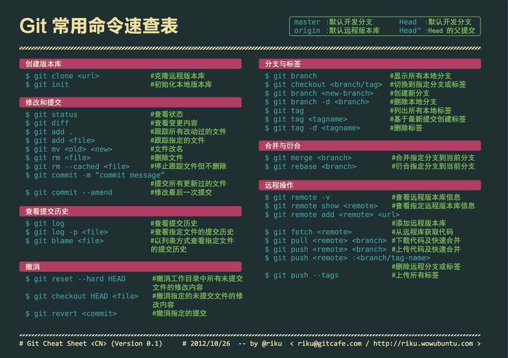
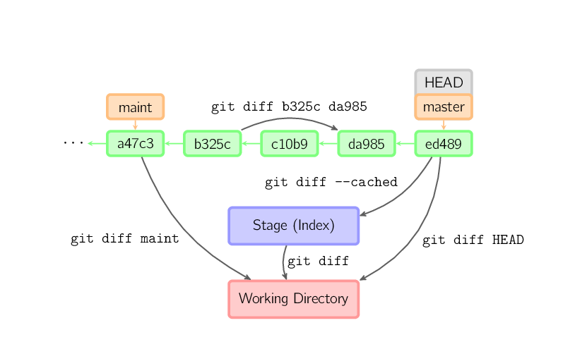
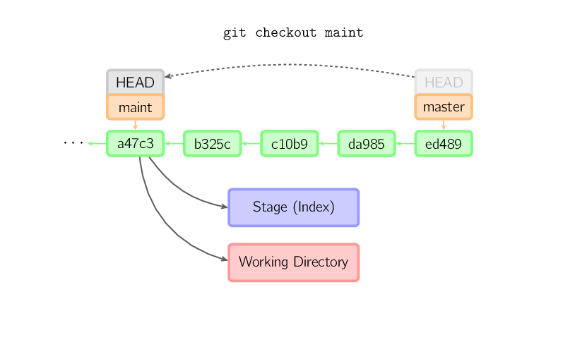
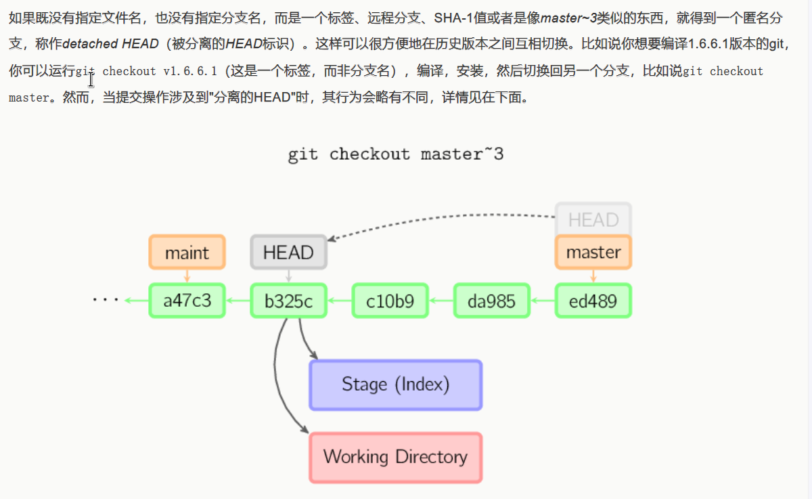

# GIT入门

## 基本概念

### 文件状态

未跟踪--已跟踪--已修改--已暂存--已提交

 1、工作区（Working Directory）

工作区是你在本地计算机上的项目目录，你在这里进行文件的创建、修改和删除操作。工作区包含了当前项目的所有文件和子目录。
特点：

- 显示项目的当前状态。
- 文件的修改在工作区中进行，但这些修改还没有被记录到版本控制中。

2、暂存区（Staging Area/ index）

暂存区是一个临时存储区域，它包含了即将被提交到版本库中的文件快照，在提交之前，你可以选择性地将工作区中的修改添加到暂存区。
特点：

- 暂存区保存了将被包括在下一个提交中的更改。
- 你可以多次使用 `git add` 命令来将文件添加到暂存区，直到你准备好提交所有更改。

3、版本库（Repository）

版本库包含项目的所有版本历史记录。图中 "HEAD"它实际上是指向你当前正在工作的分支
每次提交都会在版本库中创建一个新的快照，这些快照是不可变的，确保了项目的完整历史记录。
特点：

- 版本库分为本地版本库和远程版本库。这里主要指本地版本库。
- 本地版本库存储在 `.git` 目录中，它包含了所有提交的对象和引用。




## 常用操作



### 初始建库

```
git init												#初始化git目录

git clone
git clone <本地仓库地址> <目标地址>						#复制本地仓库，注意目标地址需为"空"、
git clone git@github.com:fsliurujie/test.git         	#SSH协议
git clone git://github.com/fsliurujie/test.git          #IT协议
git clone https://github.com/fsliurujie/test.git        #HTTPS协议

git config --global     								#去掉--global只针对当前仓库
//查
git config --global --list
git config --global user.name
git config --global user.email
//增
git config  --global --add user.name xxx
git config  --global --add user.email xxx
//删
git config  --global --unset user.name xxx
git config  --global --unset user.email xxx
//改
git config --global user.name xxx
git config --global user.email xxx
```


### 提交与修改

```
git status											#查看仓库当前的状态，显示有变更的文件。
git add <file>                                      #添加指定文件至暂存区index
git add .                                           #增加当前子目录下所有更改过的文件至index
git add -u                     						#只添加已被跟踪的修改/删除文件（不包括新文件）
git add -A                  						#添加所有变更（等同于 git add . + git add -u）

git commit -m 'xxx'                                 #提交暂存区到本地仓库。
git commit -am 'xxx'                                #将add和commit合为一步
git commit -a                                       #add当前目录下文件加入暂存区域再commit.
git commit --amend -m 'xxx'                         #合并上一次提交（取消上一次重新提交，用于反复修改）

git diff                                            #显示所有未添加至index的变更
git diff --cached                                   #显示所有已添加index但还未commit的变更
git diff HEAD^                                      #比较与上一个版本的差异
git diff HEAD -- ./lib                              #比较与HEAD版本lib目录的差异
git diff origin/master..master                      #比较远程分支master上有本地分支master上没有的
git diff origin/master..master --stat               #只显示差异的文件，不显示具体内容
git difftool										#使用外部差异工具查看和比较文件的更改。
git range-diff										#比较两个提交范围之间的差异。

git reflog                    						#查看 HEAD 的操作历史（包括 reset、checkout、commit 等）
git reflog show main          						#查看 main 分支的操作历史
git checkout <commit-hash>    						#先检出丢失的提交
git branch recovery-branch    						#创建分支保存

git revert <提交id>								  #撤销提交。
git reset											#回退版本。
git reset HEAD										#暂存区目录树被重写，被master分支指向目录树替换，但不影响工作区。
													即系暂存区内容重置为HEAD(当前最新提交)状态，一般是刚add完想反悔
git reset --hard HEAD                               #将当前版本重置为HEAD(包括版本库/暂存区/工作区,通常用于merge失败回退)
git reset --soft HEAD                               #撤销commit动作，准备马上修改
git cherry-pick										#复制一个提交节点并在当前分支做一次完全一样的新提交。

git rm <file>										#将文件从暂存区和工作区中删除。
git rm --cached <file> 								#直接从暂存区删除文件，工作区则不做出改变。
git rm -r *                                         #递归删除,haha跑路啰

git stash                                           #暂存当前修改，将所有至为HEAD状态
git stash list                                      #查看所有暂存
git stash apply stash@{0}                           #应用第一次暂存

```


DIFF

Checkout




### 日志相关

```
git log													#查看历史提交记录
git log --stat                                          #显示提交日志及相关变动文件
git shortlog											#查看简洁的提交日志摘要
git blame <file>										#以列表形式查看指定文件的历史修改记录

git show <提交id>										  #显示某个提交的详细内容
git show HEAD                                           #显示HEAD提交日志
git show HEAD^                                          #显示HEAD的父（上一版本）提交日志 ^^为上两个版本 ^5为上5个版本
```


### 分支管理

**分支与标签**

```
git branch                                                # 显示本地分支
git branch --contains 50089                               # 显示包含提交50089的分支
git branch -a                                             # 显示所有分支
git branch -r                                             # 显示所有原创分支
git branch --merged                                       # 显示所有已合并到当前分支的分支
git branch --no-merged                                    # 显示所有未合并到当前分支的分支
git branch -m master master_copy                          # 本地分支改名
git branch -d <branchname>								  # 删除本地分支
git branch -D <branchname>								  # 强制删除未合并的分支：
git push origin --delete <branchname>					  # 删除远程分支

git checkout -b master_copy                               # 从当前分支创建新分支master_copy并切换
git checkout -b master master_copy                        # 上面的完整版
git checkout -b devel origin/develop                      # 从远程分支develop创建新本地分支devel并检出
git checkout features/performance                         # 检出已存在的features/performance分支
git checkout --track hotfixes/BJVEP933                    # 检出远程分支hotfixes/BJVEP933并创建本地跟踪分支
git checkout v2.0                                         # 检出版本v2.0
git checkout -- files                                     # 把文件从暂存区复制到工作区（用于修改工作区文件回退错误
git checkout HEAD -- files 								  # 将工作区文件回滚到head最后一次提交，并加到暂存区。

git merge <branchname>									  # 将其他分支合并到当前分支
git rebase master										  #	当前新提交接到maser最新提交后边
git switch 											      # Git 2.23 版本引入，更清晰地切换分支。
git switch branch-name                                    # 切换到指定分支
git switch -c branch-name                                 # 创建并切换到指定分支
git restore 										      # Git 2.23 版本引入，恢复或撤销文件的更改。
git tag 1.0.0 1b2e1d63ff                                  # 给某次提交打标签
git tag -a v1.0 -m "Release 1.0"    					  # 创建带注释的标签（推荐）
git tag -d v1.0                    	 					  # 删除本地标签
git push origin v1.0                  				      # 推送单个标签
git push origin --tags              					  # 推送所有本地标签
git push origin :refs/tags/v1.0     					  # 删除远程标签

```

**合并和变基**

merge：AB分支合并产生新提交节点
rebase：A放B后不产生新的节点，将一个分支上的更改移到另一个分支之上。它可以帮助保持提交历史的线性，减少合并时的冲突

**进阶**：Git Flow 是一种常用的分支工作流，分为以下几种分支类型：

- 主分支（main/master）：存储生产代码。
- 开发分支（develop）：存储即将发布的代码。
- 功能分支（feature）：从 develop 分支创建，用于开发新功能。
- 发布分支（release）：从 develop 分支创建，用于准备发布。
- 热修复分支（hotfix）：从 main 分支创建，用于紧急修复生产问题。

### 远程操作

```
git remote add origin <server>							  # 连接远程仓库
git push origin master									  # 上传代码到远程分支master并merge合并
git push --tags                                           # 把所有tag推送到远程仓库
git pull origin master                                    # 获取远程分支master并merge到当前分支
git fetch												  # 获取远程代码
git fetch --prune                                         # 获取所有原创分支并清除服务器上已删掉的分支
git merge origin/master                                   # 合并远程master分支至当前分支

```


## 工作流组合

### 发布新项目到远程

```
git init
git add .
git commit -m "Initial commit"
git remote add origin <远程仓库地址>
git push -u origin main
```


### 开发新功能合并

```
git checkout -b feature/new-login   # 创建并切换到功能分支

# ... 编写代码中 ...
git add .
git commit -m "feat: 实现新登录逻辑"
git checkout main                    # 切回主分支
git pull origin main                 # 拉取最新代码
git merge feature/new-login          # 合并功能分支
git push origin main
```


### 同步上游仓库（Fork 场景）

```
git remote add upstream <原仓库地址>   # 添加上游仓库（仅需一次）
git fetch upstream
git checkout main
git rebase upstream/main              # 将本地 main 分支变基到上游
git push origin main                  # 强制推送更新 Fork（可能需要 --force）
```


### 撤销最后一次提交（保留修改）

```
git reset --soft HEAD~1               # 撤销提交，代码保留在工作区
git reset HEAD .                      # 可选：取消暂存
git restore <file>                    # 可选：放弃某个文件的修改
```


## Git TO GitHub

```
ssh - keygen - t rsa - C "youremail@example.com"			#ssh密钥生成
```

成功的话就会在**adminstrator/**下生成**.ssh**文件夹，进去，打开**id_rsa.pub**，复制里面的**key**。然后到GitHub设置SSH配置即可完成连接

1. 初始化本地 Git 仓库：git init
2. 添加文件到暂存区：git add .
3. 提交更改到本地仓库：git commit -m "First commit"
4. 查看当前SSH配置有哪些远程仓库git remote -vorigin 
5. 关联远程仓库地址：git remote add origin <您复制的SSH URL>
6. 推送代码到：git push -u origin main(-u 参数会将本地分支与远程分支建立追踪关系，方便以后直接执行 git push)

## 避坑指南

1. **reset --hard 慎用**：这会永久丢弃未提交的更改和指定提交之后的所有历史。如有疑虑，可先用 git stash 储藏当前修改。

   

2. 已推送的提交不要 amend：git commit --amend 会改变提交哈希，如果已经推送到远程，且别人基于此开发，会导致历史混乱。

   若必须修改，需使用 --force-with-lease 强制推送，但务必与团队沟通。

   

3. **公共分支禁用 rebase**：main、develop 等多人协作的分支上不要执行 git rebase，应使用 git merge 以保留真实的历史合并记录。

   

4. **revert 是最安全的远程撤销**：对于已经推送到远程的提交，使用 git revert <commit> 而不是 reset，因为它会生成一个新的反向提交，

   不影响已有历史。

   

5. 善用 reflog 找回丢失的提交：如果因为 reset、rebase 等操作弄丢了代码，立即执行 git reflog 查看 HEAD 的历史，找到对应的

    commit id 即可恢复。

   

6. 保持提交信息清晰：推荐采用 <type>: <subject> 格式，如 feat: add user login、fix: resolve null pointer exception。

   

7. 定期拉取上游更新：在功能分支上开发时，定期 git fetch 并 git rebase main（或 merge）可以避免最终合并时产生大量冲突。


